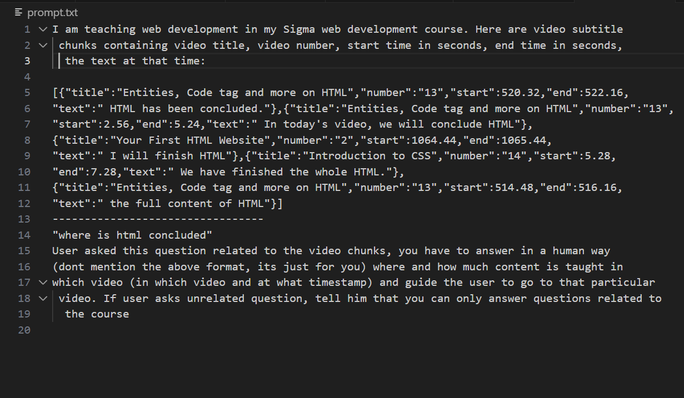

# 📚 RAG Course Assistant

This project is a **Retrieval-Augmented Generation (RAG)** system designed as a **course assistant**.  
It helps students quickly find where topics are explained in long video lectures.

## 🚀 Features
- 🎥 Extracts audio from course videos using `ffmpeg`
- 📝 Transcribes + translates audio into English with **Whisper**
- 🔎 Splits into chunks and generates embeddings with **bge-m3 (Ollama)**
- 📂 Stores embeddings with `joblib`
- ❓ Retrieves top chunks for a user’s query
- 🤖 Generates natural answers using **Llama3.2**

## 🛠️ Tech Stack
- Python
- Whisper
- Ollama (`bge-m3`, `llama3.2`)
- scikit-learn (cosine similarity)
- Pandas / NumPy
- ffmpeg

## 📖 How it Works
1. Convert course videos → audio (`ffmpeg`)
2. Transcribe + translate audio (`Whisper`)
3. Break into chunks + embed (`bge-m3`)
4. Store embeddings in dataframe (`joblib`)
5. On query → retrieve top-k similar chunks (`cosine similarity`)
6. Generate human-like answer (`Llama3.2`)


# Install dependencies
pip install -r requirements.txt


## 📸 Screenshots

### 🔹 JSON Output
Transcribed chunks stored as JSON:  


### 🔹 Sample Prompt
Prompt:  "where is html concluded"


### 🔹 Response
Example of how a user query gets answered:  


## 📂 Project Structure

```text
RAG-Project/
├── audios/              # extracted audio files (ignored in git)
├── videos/              # original course videos (ignored in git)
├── jsons/               # Whisper transcripts (ignored in git)
├── process_incoming.py  # main RAG pipeline
├── video_to_mp3.py      # video → audio
├── mp3_to_json.py       # audio → transcript
├── read_chunks.py       # build embeddings
├── embeddings.joblib    # stored embeddings (ignored in git)
├── README.md
└── .gitignore


